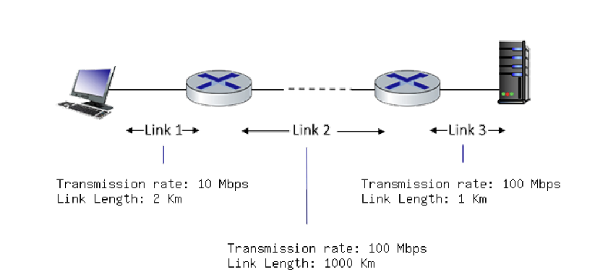

# Eksamen S2024

Subject: TTM4100 - KTN
Date: 28. mai 2025
Keywords: exam

## Q1 - Multiple Choice

**Q1.1.1 What is the Internet? Which of the following descriptions below correspond to a "nuts-andbolts" view of the Internet? Select one or more of the answers below that are correct:**

a) A collection of billions of computing devices, and packet switches interconnected by links.
b) A platform for building network applications.
c) A "network of networks".
d) A place I go for information, entertainment, and to communicate with people.
e) A collection of hardware and software components executing protocols that define the format andthe order of messages exchanged between two or more communicating entities, as well as the
actions taken on the transmission and/or receipt of a message or other event.

<aside>
📌

The service view would be (b) and (d)

</aside>

---

**Q1.1.2 Link Transmission Characteristics. Which of the following physical layer technologies has the highest transmission rate and lowest bit error rate in practice?**

a) Fiber optic cable
b) Coaxial cable
c) Twisted pair (e.g., CAT5, CAT6)
d) 802.11 WiFi Channel
e) Satellite channel
f) 4G/5G cellular

<aside>
📌

- Fiber optic cable offers:
    - Highest transmission rates (can exceed 100 Gbps and beyond)
    - Lowest bit error rates (BER is extremely low due to minimal interference and signal degradation)
- Coaxial cable: Good for medium speeds, higher BER than fiber.
- Twisted pair (CAT5/CAT6): Common in Ethernet, but slower and more prone to interference than fiber.
- 802.11 WiFi: Wireless, affected by interference and obstacles, higher BER.
- Satellite: Long delays, high BER due to distance and noise.
- 4G/5G: Improved speed and reliability, but still wireless, more BER than fiber.
</aside>

---

**Q1.1.3 Routing versus forwarding. Choose one of the following two definitions that makes the correct distinction between routing versus forwarding.**
a) Forwarding is the local action of moving arriving packets from router’s input link to appropriate
router output link, while routing is the global action of determining the source-destination paths
taken by packets.
b) Routing is the local action of moving arriving packets from router’s input link to appropriate
router output link, while forwarding is the global action of determining the source-destination
paths taken by packets.

---

**Q1.1.4 What is a network of networks? When we say that the Internet is a “network of networks,” we mean? Check all that apply.**
a) The Internet is the largest network ever built.
b) The Internet is made up of a lot of different networks that are interconnected to each other.
c) The Internet is the fastest network ever built.
d) The Internet is made up of access networks at the edge, tier-1 networks at the core, and
interconnected regional and content provider networks as well.

---

**Q.1.1.5 Computing Packet Transmission Delay. Consider the network shown in the figure below, with three links, each with the specified transmission rate and link length. Assume the length of a packet is 8000bits. What is the transmission delay at link 2?**

a) 8x10-5 secs
b) .00096 secs
c) 100 secs
d) 12,500 secs
e) 12.5 secs

<aside>
📌

Transmission rate = L/R

L = 8000bits

R = 100Mbps = 100 000 000 bits/s

8000/100 000 000 = 0.00008

</aside>

---

**Q.1.1.6 What is "encapsulation"? Which of the definitions below describe what is meant by the term "encapsulation"?**

a) Computing the sum of all of the bytes within a packet and placing that value in the packet header
field.
b) Determining the name of the destination host, translating that name to an IP address and then
placing that value in a packet header field.
c) Taking data from the layer above, adding header fields appropriate for this layer, and then placing
the data in the payload field of the “packet” for that layer.
d) Receiving a “packet” from the layer below, extracting the payload field, and after some internal
actions possibly delivering that payload to an upper layer protocol.
e) Starting a transport layer timer for a transmitted segment, and then if an ACK segment isn’t
received before the timeout, placing that segment in a retransmission queue

<aside>
📌

Encapsulation refers to how network layers interact:

- A layer takes the data from the layer above.
- It adds its own header (and sometimes footer).
- This whole package becomes the payload for the layer below.

It happens at each layer of the network stack (application → transport → network → data link).

</aside>

**Q.1.1.7 Performance: Maximum Throughput. Consider the network shown below, with a sending server on the left, sending packets to two different client receivers on the right. The sender is sending packets to the receivers over separate TCP connections. Assume that the link with capacity R1 is fairly shared (as we've seen is done via TCP) between the two sessions. The links have transmission rates of R1 = 200 Mbps. Assume initially that R2 = R3 = 25 Mbps. Suppose each packet is 1 Mbit in size. What is the maximum end-to-end throughput achieved by each session, assuming both sessions are sending at the maximum rate possible?**

a) 25 Mbps
b) 100 Mbps
c) 50 Mbps
d) 1 Mbit
e) 200 Mbps

<aside>
📌

Maximum throughput is decided by the bottleneck in the link. 

Each session gets 100mbps from R1 (200/2).

Both R2 and R3 has 25 mbps.

R2 and R3 are therefore the bottlenecks with 25mbps.

</aside>

---

**Q.1.1.8 Performance: End-to-end delay. Consider the scenario shown below, with 10 different servers (four shown) connected to 10 different clients over ten three-hop paths. The pairs share a common middle hop with a transmission capacity of R = 200 Mbps. Each link from a server has to the shared link has a transmission capacity of RS = 25 Mbps. Each link from the shared middle link to a client has a transmission capacity of RC = 50 Mbps**

**Now consider the three-hop path from Server-10 to host-10, assuming the values of Rs, Rc, and R given above. Assume also that a packet is 1000 bits long, and that each link has a propagation delay of 100 microseconds. You can assume that queueing delay and nodal processing delays are zero. What is the total amount of time from when a server starts sending a packet until a host completely receives that packet?**
a) 325 microseconds
b) 365 microseconds
c) 735 microseconds
d) 450 microseconds
e) 350 microseconds
f) 555 microseconds

<aside>
📌

There are 3 links, Rs, Rc and R, so 300 microseconds in propagation delay

Transmission delay from server = 1000/25 000 000 = 40 microseconds

Transmission delay in shared link = 1000/200 000 000 = 5 microseconds

Transmission delay from middle hop = 1000/50 000 000 = 20 microseconds

300 + 40 + 20 + 5 = 365 microseconds.

</aside>

---

**Q.1.1.9 Performance: Link Utilization. Consider the scenario below where 4 TCP senders are connected to 4 receivers. The servers transmit to the receiving hosts at the fastest rate possible (i.e., at the rate at which the bottleneck link between a server and its destination is operating at 100% utilization, and is fairly shared among the connections passing through that link).**

**Suppose that R = 1 Gbps and RC is 300 Mbps and Rs is 200 Mbps. Assuming that the servers are sending at their maximum rate possible, enter the link utilizations for the client links (whose rate is Rc) below. What is the utilization of the client links, whose rate is RC? Enter your answer as a decimal, of the form 1.00 (if the utilization is 1, or 0.xx if the utilization is less than 1, rounded to the closest xx).**

<aside>
📌

The shared link R can support a total of 1000 Mbps. If all servers send data simultaneously, this bandwidth is shared among the 4 hosts.

Each client link Rc supports up to 300 Mbps, but since the shared link R can only provide 250 Mbps to each host, the effective maximum rate to each host is limited to 250 Mbps.

However, each server is transmitting at a rate of Rs=200 Mbps, which is below this limit. Therefore, the maximum achievable rate per server-host pair is 200 Mbps.

This means that the link utilization is 200/300 = 0.67

</aside>

---

**Q1.2.1 UDP service. When an application uses a UDP socket, what transport services are provided to the application by UDP? Check all that apply.**

a) Throughput guarantee. The socket can be configured to provide a minimum throughput guarantee between sender and receiver.
b) Loss-free data transfer. The service will reliably transfer all data to the receiver, recovering from
packets dropped in the network due to router buffer overflow.
c) Flow Control. The provided service will ensure that the sender does not send so fast as to
overflow receiver buffers.
d) Real-time delivery. The service will guarantee that data will be delivered to the receiver within a
specified time bound.
e) Best effort service. The service will make a best effort to deliver data to the destination but makes no guarantees that any particular segment of data will actually get there.
f) Congestion control. The service will control senders so that the senders do not collectively send
more data than links in the network can handle.

---

**Q1.2.2 TCP service. When an application uses a TCP socket, what transport services are provided to the application by TCP? Check all that apply.**

a) Throughput guarantee. The socket can be configured to provide a minimum throughput guarantee between sender and receiver.
b) Loss-free data transfer. The service will reliably transfer all data to the receiver, recovering from
packets dropped in the network due to router buffer overflow.
c) Flow Control. The provided service will ensure that the sender does not send so fast as to overflow receiver buffers.
d) Real-time delivery. The service will guarantee that data will be delivered to the receiver within a
specified time bound.
e) Best effort service. The service will make a best effort to deliver data to the destination but makes no guarantees that any particular segment of data will actually get there.
f) Congestion control. The service will control senders so that the senders do not collectively send
more data than links in the network can handle

---

**Q1.2.3 The HTTP GET. What is the purpose of the HTTP GET message?**

a) The HTTP GET request message is used by a web client to request a web server to send the
requested object from the server to the client.
b) The HTTP GET request message is used by a web client to post an object on a web server.
c) The HTTP GET request message is sent by a web server to a web client to get the identity of the
web client.
d) The HTTP GET request message is sent by a web server to a web client to get the next request
from the web client.

---

**Q1.2.4 Why Web Caching? Which of the following are advantages of using a web cache? Select one or more answers.**
a) Caching generally provides for a faster page load time at the client, if the web cache is in the
client’s institutional network, because the page is loaded from the nearby cache rather than from
the distant server.
b) Caching allows an origin server to more carefully track which clients are requesting and receiving
which web objects.
c) Overall, caching requires fewer devices/hosts to satisfy a web request, thus saving on server/cache costs.
d) Caching uses less bandwidth coming into an institutional network where the client is located, if
the cache is also located in that institutional network.

---

**Q1.2.5 Comparing and contrasting HTTP and SMTP. Which of the following characteristics apply to HTTP only (and do not apply to SMTP)? Note: check one or more of the characteristics below.**
a) Has ASCII command/response interaction, status codes.
b) Operates mostly as a “client push” protocol.
c) Operates mostly as a “client pull” protocol.
d) Is able to use a persistent TCP connection to transfer multiple objects.
e) Uses CRLF to indicate end of message.
f) Uses a blank line (CRLF) to indicate end of request header.
g) Uses server port 80.
h) Uses server port 25.

---

**Q1.2.6 UDP Sockets. Which of the following characteristics below are associated with a UDP socket? Check one or more that apply.**

a) socket(AF_INET, SOCK_STREAM) creates this type of socket
b) socket(AF_INET, SOCK_DGRAM) creates this type of socket
c) a server can perform an accept() on this type of socket
d) provides unreliable transfer of a groups of bytes (“a datagram”), from client to server
e) provides reliable, in-order byte-stream transfer (a “pipe”), from client to server
f) the application must explicitly specify the IP destination address and port number for each group
of bytes written into a socket
g) when contacted, the server will create a new server-side socket to communicate with that client
h) data from different clients can be received on the same socket

---

**Q1.2.7 TCP Sockets. Which of the following characteristics below are associated with a TCP socket? Check one or more that apply.**

a) socket(AF_INET, SOCK_STREAM) creates this type of socket
b) socket(AF_INET, SOCK_DGRAM) creates this type of socket
c) a server can perform an accept() on this type of socket
d) provides unreliable transfer of a group of bytes (a “datagram”), from client to server
e) provides reliable, in-order byte-stream transfer (a “pipe”), from client to server
f) the application must explicitly specify the IP destination address and port number for each group
of bytes written into a socket
g) when contacted, the server will create a new server-side socket to communicate with that client
h) data from different clients can be received on the same socket

---

**Q1.2.8 Computing the Internet Checksum. Compute the Internet checksum value for these two 16-bit words: 11110101 11010011 and 10110011 01000100. What is correct?**
a) 01010110 11101000
b) 01011110 11000101
c) 01010110 11100111
d) 01101110 11010101
e) None of the above

<aside>
📌

Sum the two 16-bit words and take the opposite. (NOT operation)

</aside>

---

**Q 1.2.9 Phases of TCP congestion control. Consider the figure below, which plots the evolution of TCP's congestion window at the beginning of each time unit (where the unit of time is equal to the RTT). In the abstract model for this problem, TCP sends a "flight" of packets of size cwnd at the beginning of each time unit. The result of sending that flight of packets is that either (i) all packets are ACKed at the end of the time unit, (ii) there is a timeout for the first packet, or (iii) there is a triple duplicate ACK for the first packet. During which of the following intervals of time is TCP performing slow start?**

a) [1,3]
b) [4,15]
c) 16
d) 17
e) 18
f) [22,24]
g) None of the above

<aside>
📌

A slow start increases exponetially. The congestion window starts small, for every ACK, TCP increases the cwnd by 1 segment. Since each ACK corresponds to sucsessfully received data , the cwnd doubles each RTT. After reaching the threshold (sstresh) it switches to congestion avoidance, where it grows linearly.

Comment to the graph(unrelated to the question): the graph goes back to 0 each time there is detected a timeout and restarts the whole process. If it detects duplicate ACKs → it only halves the cwnd (as shown in the graph.

</aside>

---

**Q1.3.1 What is a subnet? What is meant by an IP subnet? (Check zero, one or more of the following
characteristics of an IP subnet).**

a) A set of device interfaces that can physically reach each other without passing through an
intervening router.
b) A set of devices that always have a common first 16 bits in their IP address.
c) A set of devices that have a common set of leading high order bits in their IP address.
d) A set of devices all manufactured by the same equipment maker/vendor.
e) None of the above

**Q1.3.2 The network layer - where is it? Check all of the statements below about where (in the network) the network layer is implemented that are true.**
a) The network layer is implemented in hosts at the network's edge.
b) The network layer is implemented in routers in the network core.
c) The network layer is implemented in Ethernet switches in a local area network.
d) The network layer is implemented in wired Internet-connected devices but not wireless Internetconnected devices.
e) None of the above

---

Longest prefix matching. Consider the following forwarding table below.

Indicate the output to link interface to which a datagram with the destination addresses below (in the “Match Items” column) will be forwarded under longest prefix matching. (Note: The list of addresses is ordered below. If two addresses map to the same output link interface, map the first of these two addresses to the first instance of that link interface).

<aside>
📌

1 - A

2 - B

3 - C

4 - D

5 - F

6 - G

7 - H

</aside>

---

**Q1.3.4 Subnetting. Consider the three subnets in the diagram below.
Which of the following addresses can not be used by an interface in the 223.1.3/29 network?
Check all that apply.**

a) 223.1.3.6
b) 223.1.3.2
c) 223.1.3.16
d) 223.1.2.6
e) 223.1.3.28
f) None of the above

<aside>
📌

/29 subnet = 32-29 = 3 host bits

2^3 = 8 ip adresses (6 usable)

Range: 223.1.3.0 - 223.1.3.8 (not including the first and second)

Only (a) and (b) fits inside this range

</aside>

---

**Q1.3.5. IPv4 versus IPv6. Which of the following fields occur ONLY in the IPv6 datagram header (i.e.,
appear in the IPv6 header but not in the IPv4 header)? Check all that apply.**

a) 128-bit source and destination IP addresses.
b) The IP version number field.
c) The time-to-live (or hop limit) field.
d) The header checksum field.
e) The flow label field.
f) The header length field.
g) The options field.
h) The upper layer protocol (or next header) field.

---

**Q1.3.6 ICMP: Internet control message protocol. Which of the statements below about ICMP are true?**
a) ICMP is used by hosts and routers to communicate network-level information.
b) ICMP messages are carried directly in IP datagrams rather than as payload in UDP or TCP
segments.
c) ICMP communicates information between hosts and routers by marking bits in the IP header.
d) The TTL-expired message type in ICMP is used by the traceroute program.
e) ICMP messages are carried in UDP segments using port number 86.
f) None of the above

<aside>
📌

ICMP is used for error messages and diagnostics (traceroute, ping)

</aside>

---

**Q1.3.7 Best effort service. Which of the following quality-of-service guarantees are part of the Internet’s best-effort service model? Check all that apply.**

a) Guaranteed delivery from sending host to receiving host.
b) Guaranteed delivery time from sending host to receiving host.
c) In-order datagram payload delivery to the transport layer of those datagrams arriving to the
receiving host.
d) A guaranteed minimum bandwidth is provided to a source-to-destination flow of packets
e) None of the other services listed here are part of the best-effort service model. Evidently, besteffort service really means no guarantees at all.
f) None of the above

---

**Q1.3.8 Where does destination address lookup happen? Where in a router is the destination IP address looked up in a forwarding table to determine the appropriate output port to which the datagram should be directed?**

a) At the input port where a packet arrives
b) At the output port leading to the next hop towards the destination
c) Within the switching fabric
d) Within the routing processor
e) None of the above

---

**Q1.3.9 Packet dropping. Suppose a datagram is switched through the switching fabric and arrives to its appropriate output to find that there are no free buffers. In this case:**
a) The packet will be dropped (lost).
b) The packet will be sent back to the input port.
c) Another packet will be removed (lost) from the buffer to make room for this packet.
d) The packet will either be dropped, or another packet will be removed (lost) from the buffer to
make room for this packet, depending on policy. But the packet will definitely not be sent back to
the input port.
e) None of the above

---

**Q1.3.10 Network Address Translation. Consider the following scenario in which host 10.0.0.1 is
communicating with an external web server at IP address 128.119.40.186. The NAT table shows the table entry associated with this TCP flow.
What are the source and destination IP address and port numbers at point D?**

<aside>
📌

1. 128.119.40.186
2. 10.0.0.1
3. 80
4. 2020
</aside>

---

**Q1.4.1 Link-layer services. Which of the following services may be implemented in a link-layer protocol? Select one or more statements.**

a) Reliable data transfer between directly connected nodes.
b) Lookup and forwarding on the basis of an IP destination address.
c) Flow control between directly connected nodes.
d) TLS security (including authentication) between directly connected nodes.
e) Coordinated access to a shared physical medium.
f) Bit-level error detection and correction.
g) Multiplexing down from / multiplexing up to a network-layer protocol.
h) End-end path determination through multiple IP routers.

<aside>
📌

Link layer:

- Takes raw bits from the physical layer and groups them into frames with headers and trails to organize data.
- Uses MAC addresses to identify devices on the same local network segment.
- Error detection (like CRC)
- Manage pace of data transmission
- In shared media (ethernet) it controls who can transmit data when. (csma/cd)

TLDR: The link layer ensures data frames are properly formed, addressed, error-checked, and transmitted between devices on the same physical network.

</aside>

---

**Q1.4.2 Pure Aloha and CSMA. Which of the following statements is true about both Pure Aloha, and CSMA (both with and without collision detection)?**

a) There can be simultaneous transmissions resulting in collisions.
b) There can be times when the channel is idle, when a node has a frame to send, but is prevented
from doing so by the medium access protocol.
c) Pure Aloha and CSMA can achieve 100% channel utilization, in the case that all nodes always
have frames to send.
d) Pure Aloha and CSMA can achieve 100% utilization, in the case that there is only one node that
always has frames to send
e) None of the above

---

**Q1.4.3 Multiple Access protocols. Consider the figure below, which shows the arrival of 6 messages for transmission at different multiple access wireless nodes at times t=0.1, 1.4, 1.8, 3.2, 3.3, 4.1. Each transmission requires exactly one time unit. For the CSMA protocol (without collision detection), indicate which packets are successfully transmitted. You should assume that it takes 0.2 time units for a signal to propagate from one node to each of the other nodes. You can assume that if a packet experiences a collision or senses the channel busy, then that node will not attempt a retransmission of that packet until sometime after t=5. Hint: consider propagation times carefully here.**

a) 1
b) 2
c) 3
d) 4
e) 5
f) 6

<aside>
📌

Packet 1 (arrives t=0.1):

- Channel is free → transmits immediately
- Transmission period: t=0.1 to t=1.1
- Result: Successfully transmitted

Packet 2 (arrives t=1.4):

- Packet 1 completed at t=1.1, signal fully propagated by t=1.3
- Channel is free at t=1.4 → transmits immediately
- Transmission period: t=1.4 to t=2.4
- Result: Successfully transmitted

Packet 3 (arrives t=1.8):

- Packet 2 started at t=1.4, signal propagated to other nodes by t=1.6
- At t=1.8, packet 3 senses packet 2 still transmitting (ends at t=2.4)
- Result: Defers transmission (channel busy)

Packet 4 (arrives t=3.2):

- Packet 2 finished at t=2.4, packet 3 never transmitted
- Channel is free at t=3.2 → starts transmitting
- Transmission period: t=3.2 to t=4.2

Packet 5 (arrives t=3.3):

- Packet 4 started at t=3.2, but signal takes 0.2 time units to propagate
- At t=3.3, packet 4's signal hasn't reached packet 5's node yet (arrives at t=3.4)
- Packet 5 senses channel as free → starts transmitting
- Transmission period: t=3.3 to t=4.3
- Result: COLLISION between packets 4 and 5 (both fail)

Packet 6 (arrives t=4.1):

- Packet 5 is still transmitting until t=4.3 (despite collision)
- At t=4.1, packet 6 senses ongoing transmission on channel
- Result: Defers transmission (channel busy)

</aside>

---

Q**1.4.4 Multiple Access protocols. Consider the figure below, which shows the arrival of 6 messages for transmission at different multiple access wireless nodes at times t=0.1, 0.8, 1.35, 2.6, 3.9, 4.2. Each transmission requires exactly one time unit.**

**For the CSMA/CD protocol (with collision detection), indicate which packets are successfully transmitted. You should assume that it takes 0.2 time units for a signal to propagate from one node to each of the other nodes. You can assume that if a packet experiences a collision or senses the channel busy and that that node will not attempt a retransmission of that packet until sometime after t=5. If a node senses a collision, it stops transmitting immediately (although it will still take 0.2 time units for the last transmitted bit to propagate to all other nodes).
Hint: consider propagation times carefully here.**

a) 1
b) 2
c) 3
d) 4
e) 5
f) 6

<aside>
📌

Packet 1 (arrives at t=0.1)

- Free channel → transmits immediatly
- Transmission period 0.1-1.1

Packet 2 (arrives at t= 0.8)

- Packet 1 can be heard from 0.3.
- Senses 1 → defers

Packet 3 (arrives at t=1.35)

- Free channel → transmits immediatly
- Transmission period: 1.35 - 2.35

Packet 4 (arrives at 2.6)

- Free channel → transmitted
- Transmisison period: 2.6-3.6

Packet 5(arrives at t=3.9)

- Free channel → transmitted
- Period: 3.9-4.9

Packet 6 (arrives at 4.2)

- Packet 5 signal reaches at 4.1
- Packet 6 senses → defers
</aside>

---

**Q.1.4.5 Two dimensional parity. Which of the following statements is true about a two-dimensional parity check (2D-parity) computed over a payload?**

a) 2D-parity can detect any case of a single bit flip in the payload.
b) 2D-parity can detect and correct any case of a single bit flip in the payload.
c) 2D-parity can detect any case of two bit flips in the payload.
d) 2D-parity can detect and correct any case of two bit flips in the payload.
e) None of the above

---

**Q.1.4.6 RTS/CTS frames. What is the purpose of RTS (request to send) and CTS (clear to send) frames in WiFi (802.11) networks? Select one or more of the answers below.**

a) RTC/CTS frames allow a sender to gather CTS frames from all other network nodes, so that it
knows it can then send without collisions.
b) A CTS allows a receiver to let the sender (who sent that RTS) know that it (the receiver) has
enough buffers to hold a frame transmitted by that sender
c) A CTS that is sent allows a receiver to force other nodes (other than the intended sender who sent
the RTS) to refrain from transmitting, thus allowing the sender who sent the RTS to then transmit
a frame with less likelihood of a collision.
d) RTC/CTS frames help nodes in a wireless network mitigate the effects of the hidden terminal
problem.
e) None of the above

---

**Q1.4.7 Overlapping 802.11 wireless networks**
**Consider the scenario shown below in which there are four wireless nodes, A, B, C, and D. The radio coverage of the four nodes is shown via the shaded ovals; all nodes share the same frequency. When A transmits, it can only be heard/received by B; when B transmits, both A and C can hear/receive from B; when C transmits, both B and D can hear/receive from C; when D transmits, only C can hear/receive from D. If a node hears two simultaneous transmissions at a time, the messages interfere at that receiver, even though they may not interfere at other receivers, where only one of the messages is heard. Suppose now that each node has an infinite supply of messages that it wants to send to each of the other nodes. If a message’s destination is not an immediate neighbor, then the message must be relayed. For example, if A wants to send to D, a message from A must first be sent to B, which then sends the message to C, which then sends the message to D. Time is slotted, with a message transmission time taking exactly one time slot, e.g., as in slotted Aloha. During a slot, a node can do one of the following: (i) send a message (ii) receive a message (if exactly one message is being sent to it), (iii) remain silent. As always, if a node hears two or more simultaneous transmissions, a collision occurs and none of the transmitted messages are received successfully. You can assume here that there are no bit-level errors, and thus if exactly one message is heard at a receiver, it will be received correctly at that receiver.**

**Suppose now that an omniscient controller (e.g., a controller that knows the state of every node in the network) can command each node to do whatever it (the omniscient controller) wishes, that is, to send a message, to receive a message, or to remain silent.**

1. **Given this omniscient controller, what is the maximum rate at which messages can be transferred from C to A, given that there are no other messages between any other source/destination pairs?**
a) 0.5 messages/slot (i.e., 1 message every two slots).
b) 1 message/slot.
c) 2 messages/slot.
d) 0.25 messages/slot (i.e., one message every four slots).
e) None of the above.

<aside>
📌

C→A is sent via B. 

Slot1:  C→B
Slot2: B→A, 

So 1 message every two slots.

</aside>

1. **Suppose now that A sends messages to B, and D sends messages to C. What is the combined maximum rate at which data messages can flow from A to B and from D to C?**
a) 0.5 messages/slot (i.e., 1 message every two slots).
b) 1 message/slot.
c) 2 messages/slot.
d) 0.25 messages/slot (i.e., one message every four slots).
e) None of the above.

<aside>
📌

A→B and D→C can be sent at the same time since there will be no interferance. 

Slot1: A→B, D→C

So its 2 message/slot.

</aside>

1. **Suppose now that A sends messages to B, and C sends messages to D. What is the combined maximum rate at which data messages can flow from A to B and from C to D?**
a) 0.5 messages/slot (i.e., 1 message every two slots).
b) 1 message/slot.
c) 2 messages/slot.
d) 0.25 messages/slot (i.e., one message every four slots).
e) None of the above

<aside>
📌

A→B and C→D  can not happen at the same time since B would hear both and C

Slot1: A→B
Slot2: C→D

So 1 message per slot.

</aside>

1. **Overlapping wireless senders with ACKs. Now suppose we are again in the wireless scenario, and that for every data message sent from source to destination, the destination will send an ACK message back to the source (e.g., as in TCP). Also suppose that each ACK message takes up one slot. What is the maximum rate at which data messages can be transferred from C to A, given that there are no other messages between any other source/destination pairs? [Note that successful ACKs do not count towards data message throughput].**
a) 0.5 messages/slot (i.e., 1 message every two slots).
b) 1 message/slot.
c) 2 messages/slot.
13
d) 0.25 messages/slot (i.e., one message every four slots).
e) None of the above.

<aside>
📌

C →A happens via B.

Slot1: C→B

Slot2: B→A

Slot3: A→B (ACK)

Slot4: B→C (ACK)

1 message per 4 slots.

</aside>

---

**Suppose N people want to communicate with each other using symmetric key encryption. All
communication between any two people is visible to all other people in this group and no other person in this group should be able to decode their communication. How many keys are required in the system as a whole?**
a) N**N
b) 2**N-1
c) N*(N-1)
d) N*(N-1)/2
e) None of the above

<aside>
📌

N people needs to communicate with N-1, they share the key so its divided by 2

</aside>

---

**Q.1.4.10 Considering information transmission between Alice and Bob through a network with the existence of an intruder (Trudy). Choose which of these statements is/are correct regarding what kinds of information the intruder can access and what kinds of action can be taken:**

a) Sniffing and recording control messages on the channel
b) Recording data messages on the channel
c) Modifying or insertion of messages
d) Deletion of message or message content
e) None of the above

---