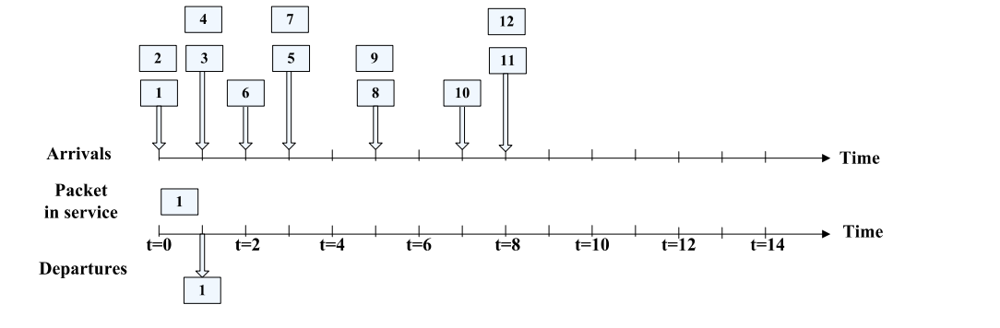

# Eksamen V2023

Subject: TTM4100 - KTN
Date: 29. mai 2025
Keywords: exam
Term: Spring 2025

## Q1 Multiple Choice

**Q1.1.1 Circuit switching and packet switching have many differences. Which of the
following is correct?**

a) Typically, while a circuit-switched network cannot guarantee a certain amount of end-toend bandwidth for the duration of a call, a packet-switched network can.
b) Typically, the delay variation among packets/messages in a circuit-switched network is
larger than that in a packet-switched network.
c) Both circuit-switched networks and packet-switched networks can provide connectionoriented services.
d) Both packet switching and circuit switching use the end system network address in the
same way.
e) None of the above is correct

---

**Q1.1.2 Consider a server and a client connected through a router. Let R1 denote the rate of
the link between the server and the router, and R2 the rate of the link between the router and the
client. Then, the server-to-client maximum throughput is:**

a) (R1+R2)/2
b) R1+R2
c) Max {R1, R2}
d) Min {R1, R2}
e) None of the above

<aside>
📌

Maximum throughput is always decided by the bottleneck (slowest link) if they are connected together in a chain. 

</aside>

---

**Q1.1.3Consider sending a file of 1 million bytes from Host A to Host B over a circuit switched network. Suppose it takes 0.5s to establish an end-to-end circuit between Host A and
Host B before Host A can begin to transmit the file. Also suppose the end-to-end circuit passes
through 2 links, and on each link the circuit has a transmission rate of 100 kbps. The propagation
delay on each link is ignored. For the minimum time that it takes to send the file from Host A to
Host B, which of the following is correct?**

a) 10.5s
b) 20.5s
c) 80s
d) 80.5s
e) None of the above

<aside>
📌

A circuit switched network does not have any “store-and-forward” mechanism. So we can consider the 2 links as one.

100kbps = 100 000 bits/s

1 million bytes = 8 million bits

8 million bits / 100 0000 bits/s = 80 seconds

We also have to add the delay to establish the connection.

So total end-to-end delay is 80 + 0.5 = 80.5.

</aside>

---

**Q1.1.4 Consider sending a file of 1 million bytes from Host A to Host B over a packet switched network. Each packet in the network has a user payload size of 1000 byte. The path
from Host A to Host B has 2 switches. The rate of the link from the first switch to the second
switch is 10 Mbps and the rate of the link from the 2nd switch to Host B is also 10 Mbps. The
propagation delay is ignored. For at least how much time that it takes to send the file from Host
A to Host B, which of the following is correct?**

a) 0.88s
b) 0.808s
c) 0.8008s
d) 8s
e) None of the above

<aside>
📌

1 million bytes / 1000 byte packets = 1000 packets.

The network is packet switched, meaning that each packet needs to have completely arrived at each switch before being sent further. This also means that when the first packet has been sent from the first switch, the next one is being sent from host A (pipelining). 

We do not know the rate of the link from host A to the first switch, so we can assume each packet starts transmitting from there instantly after the previous packet has been transmitted. (the question is only asking for the least amount of time)

10mbps = 10 000 000 bits/s

1 packet = 1000 byte = 8000 bits

Both the other links have the same speed, so:

The first packet will use 8000bits/10 000 000 bits/s = 0.0008s * 2links = 0.0016s

Each subsequent packet will then arrive at host B every 0.0008 seconds.

There are 999 packets left.

The total time is therefore 0.0016s + 999*0.0008s = 0.8008s

</aside>

---

**Q1.1.5 Protocol Layering is commonly used in computer networks because:**

a) It prevents one layer from duplicating lower-layer functionality.
b) Encapsulation is the most efficient way to transmit data.
c) It allows easy re-use and update of components in implementing the system.
d) It keeps networks structured enabling them to run faster.
e) None of the above.

---

**Q1.2.1 Which of the following protocols is/are Application-Layer protocols?**

a) ICMP (Internet Control Message Protocol)
b) DNS (Domain Name System)
c) SMTP (Simple Mail Transfer Protocol)
d) ARP (Address Resolution Protocol)
e) FTP (File Transfer Protocol)

---

**Q1.2.2 It is ____’s main task to translate hostnames to IP addresses**

a) ARP (Address Resolution Protocol)
b) DNS (Domain Name System)
c) NAT (Network Address Translator)
d) FTP (File Transfer Protocol)
e) ICMP (Internet Control Message Protocol)

---

**Consider distributing a file of 125 Mbytes to 100 peers using P2P architecture. The
server has an upload rate of 100Mbps. Each peer has a download rate of 10Mbps and an
upload rate of 10Mbps. The distribution time is at least:**

a) 1.25 seconds
b) 10 seconds
c) 12.5 seconds
d) 100 seconds
e) 125 seconds

<aside>
📌

Bottleneck = peer download rate of 10mbps

10mbps = 10 000 000bits/s

125Mbytes = 125 000 000 bytes = 1 000 000 000 bits

1 000 000 000bits /  10 000 000bits/s = 100s

</aside>

---

**Host A and Host B are communicating over a TCP connection, and Host B has
already received from A all bytes up through byte 248. Suppose Host A then sends two
segments to Host B back-to-back. The first and the second segments contain 48 and 64 bytes
of data. In the first segment, the sequence number is 249, the source port number is 502, and
the destination port number is 80. Host B sends an acknowledgement whenever it receives a
segment from Host A. In the second segment sent from Host A to Host B, for the (sequence
number, source port number, and destination port number), which of the following is correct?**

a) (296, 80, 502)
b) (296, 502, 80)
c) (297, 80, 502)
d) (297, 502, 80)
e) None of the above

<aside>
📌

Next sequence number = current sequnce number + bytes = 249 + 48 = 297

A source port = 502 (doesnt change)

B destination port 80 (doesnt change)

(297, 502, 80)

</aside>

---

**Q1.2.5 Which of the following statement(s) is/are false?**

a) FTP uses UDP as its underlying transport protocol.
b) Both UDP and TCP provide reliable data transfer service.
c) Both UDP and TCP are connection-oriented protocols.
d) With nonpersistent connections between a web browser and a web server, it is
possible for a single TCP request to carry two distinct HTTP request messages.
e) In Go-back-N, the sender is allowed to transmit multiple packets (when available)
without waiting for an acknowledgement from the receiver.

---

**Q1.3.1 The IP address 193.32.216.9 in binary notation is:**

a) 10000001 00100000 11011000 00001000
b) 11000001 00010000 11011000 00001000
c) 11000001 00100000 11011000 00001001
d) 11000001 00100000 11010000 00001001
e) None of the above

---

**Q1.3.2 Assign network addresses from 214.97.254/23 to a subnet that should have enough
addresses to support 250 interfaces. The assignment takes the form a.b.c/x. Which of the
following is/are possible correct assignment(s)?**

a) 214.97.253/24
b) 214.97.254/24
c) 214.97.255/24
d) 214.97.253/25
e) 214.97.254/25

<aside>
📌

214.97.254./23 RANGE:

214.97.254.0 - 214.97.255.255

^^ Since 23 subnet supports 512 interfaces.

What subnet supports 256 interfaces?

2^8 = 256 (254 usable), so 32-8 = /24 subnet

Check the range and correct subnet mask.

(a), (d) is outside the range

(e) is inside, but uses a 25 mask which only support 128 adresses.

</aside>

---

**Q1.3.3 About DHCP (Dynamic Host Configuration Protocol), which of the following
statement(s) is/are correct?**

a) DHCP is a client-server protocol.
b) DHCP allows a host to obtain (be allocated) an IP address automatically.
c) With DHCP, it is not possible for a given host to receive the same IP address each time it
connects to the network.
d) DHCP relies on Link Layer broadcast to function.
e) All of the above are false.

---

**Q1.3.4 About IPv4 and IPv6, which of the following statement(s) is / are correct?**

a) IPv6 has much larger address space than IPv4.
b) While IPv4 header has a checksum field to aid a router in detecting bit errors in a
received datagram, IPv6 does not have.
c) IPv6 is less reliable in transporting datagrams than IPv4.
d) IPv6 does not allow for fragmentation and reassembly at intermediate routers.
e) Both IPv4 and IPv6 are connectionless.

---

**Q1.3.5 Consider the figure below. Assume FIFO (first in first out) service. For Packet 6,
what is the queuing delay between its arrival and the beginning of the slot in which it is
transmitted?**

a) 0
b) 1
c) 2
d) 3
e) 4

<aside>
📌

(ignoring irrelevant packages)

t = 0

queue: 2

being transmitted =1

t = 1

queue: 3,4

being transmitted = 2

t = 2

queue: 4,6

being transmitted = 3

t = 3

queue: 6

being transmitted = 4

t = 4

queue: x

being transmitted = 6

6 arrives at t = 2 and starts being transmitted at t = 4 → 4-2 = 2

</aside>

---

**Q1.4.1 It is ____’s job to translate between IP addresses and MAC (medium access control)
addresses.**

a) ARP (Address Resolution Protocol)
b) DNS (Domain Name System)
c) NAT (Network Address Translator)
d) FTP (File Transfer Protocol)
e) ICMP (Internet Control Message Protocol)

---

**Q1.4.2 Which of the following alternatives show(s) correct implementation(s) of a twodimensional even parity scheme?**

<aside>
📌

(d) and (h)

</aside>

---

**Q1.4.3 About wireless physical-layer characteristics, which of the following statement(s)
is/are correct?**

a) For a given modulation scheme, the higher the SNR (signal-to-noise ratio), the lower the
BER (bit error rate).
b) For a given modulation scheme, the higher the SNR, the higher the BER.
c) For a given SNR, a modulation technique with a higher bit transmission rate has a higher
BER.
d) For a given SNR, a modulation technique with a higher bit transmission rate has a lower
BER.
e) Adaptive modulation and coding are used in WiFi, 4G and 5G networks.

<aside>
📌

Higher means cleaner signal which results in lower BER.

</aside>

---

**Q1.4.4 Which of the following element(s) is/are part (including optional parts) of 802.11
MAC for wireless LANs?**

a) Carrier Sense Multiple Access with Collision Avoidance (CSMA/CA)
b) Carrier Sense Multiple Access with Collision Detection (CSMA/CD)
c) Acknowledgement (ACK)
d) Request to Send / Clear to Send (RTS/CTS)
e) Distributed Inter-frame Space (DIFS)

---

**Q1.4.5 About 4G and 5G cellular networks, which of the following statement(s) is/are
correct?**

a) 5G provides higher peak bitrate than 4G.
b) The physical layer aspects of 5G are compatible with 4G.
c) Both 5G and 4G support mobility.
d) Both 4G and 5G core networks are designed for complete control and user-plane
separation.
e) None of the above is correct.

---

**Q1.5.1 Which of the following are desirable properties of secure communication:**

a) Confidentiality
b) Message integrity
c) End-point authentication
d) Operational security
e) Public key cryptography

---

**Q1.5.2 For a group of 10 people, to allow each member to communicate confidentially with
each of the other members separately, at least how many secret keys are necessary in total
when using symmetric key cryptography?**

a) 10
b) 15
c) 45
d) 90
e) 100

<aside>
📌

Using symmetric key cryptography each pair of people needs 1 set of the same key.

10 people needs to communicate with 9 people

10*9 = 90 keys. Since a pair uses the same keys, we divide by 2

90/2 = 45

</aside>

---

**Q1.5.3 For message integrity, which of the following statement(s) is/are correct?**

a) Message integrity is the property that the identity of the sender can be confirmed to be
who or what they claim to be.
b) Message integrity is the property that the receiver can detect whether the message sent
was altered in transit.
c) Both checksumming and hashing techniques may be used.
d) Generally, a hash provides a better message integrity check than a checksum.
e) To ensure message integrity, the transport layer protocol used to communication the
message has to be TCP.

---

**Q1.5.4 Consider the figure below, illustrating video transmission from a server to a client.
The server transmits the first video block at t0, the second block at t0+ Δ, the third block at t0+
2Δ, and so on. Once the client begins play out, each block should be played out Δ time units
after the previous block. Suppose that the client begins play out at t1+ Δ . Among the first 7
video blocks, which of them (including the first block) will have arrived at the client in time
for their play out?**

a) None
b) Block 1, Block 4, Block 5, Block 6
c) Block 1, Block 2, Block 3, Block 4, Block 5
d) Block 1, Block 2, Block 3, Block 4, Block 5, Block 6
e) All the 7 blocks

---

**Q1.5.5 In video streaming applications, HTTP streaming is more popular than UDP
streaming. The major reasons include:**

a) UDP is connectionless.
b) UDP is unreliable.
c) UDP streaming employs client-side application buffering, causing delay.
d) Many firewalls are often configured to block most UDP traffic but to allow most HTTP
traffic.
e) None of the above

---

**Q2: Flow Control vs. Congestion Control**

**Q2.1 Briefly explain three key differences between them, e.g., the context they are defined at,
when/where they are used, etc.**

<aside>
📌

Flow control used at the host level (transport layer, link layer) to ensure that the sending host is not sending packets that would overwhelm the receiving host. It is done by the receiving host sending a rwnd (a window of how much data it is willing to accept before the sender has to wait for an ack).

Congestion control is at the network level (transport layer, assisted by network layer), to ensure that the network doesnt get overwhelmed. It is done by a 3 step process (slow start, congestion avoidance, fast recovery)

</aside>

**Q2.2 Besides Transport Layer, which of Physical Layer, Link Layer and Network Layer has / have
similar concept(s)? Briefly explain your reason.**

<aside>
📌

Flow control  can be found in the link layer.

Congestion control is assisted by the network layer by indicating congestion happening.

</aside>

**Q3. Wireshark
Consider the action that a host downloads a Web page from a server. The following figure shows the packets corresponding to this action, sent and received by the host, which are captured by the Wireshark program at the host. The figure consists of two parts: Part I and Part II. Part I is the packet-listing window. Part II is the packet-header window, and the following figure of it is for “Packet 1” that denotes the first packet (Line 1 in Part I) captured by Wireshark.**

**Q3.1 What is the IP address of the host? What is the address of the server?**

<aside>
📌

SYN is sent from the host (packet 1). Look at source and destination

Host: 145.254.160.237

Server: 65.208.228.223

</aside>

**Q3.2 How many bytes are in the IP header? How many bytes are in the payload of the IP
datagram? Explain how you determine the number of payload bytes.**

<aside>
📌

The IP header has 20 bytes. (Header length)

The total length of the IP datagram is 48 bytes (Total length)

The payload is therefore the total length - the IP header.

48-20 = 28 bytes.

</aside>

**Q3.3 What is the sequence number of the TCP SYN segment that is used to initiate the TCP
connection between the host and the server? What is it in the segment that identifies the segment as a SYN segment? What TCP port number of the host is used for the TCP connection, and what TCP port number of the server is used for the TCP connection?**

<aside>
📌

Sequence number of TCP SYN is 0

It is the SYN FLAG that identifies the segment as a SYN segment. (0x02)

TCP port for the host is 3372

TCP port for the server is 80

</aside>

**Q3.4 What is the sequence number of the SYNACK segment sent by the server to the host in reply
to the SYN?**

<aside>
📌

Sequence number for SYNACK i 0

</aside>

**Q3.5 How many bytes of data are carried by the TCP segment of “Packet 6”, i.e. the 6th packet
(Line 6 in Part I) captured by Wireshark? Explain how you decide this number.**

<aside>
📌

In packet 7 the ACK sendt as an answer from the server to the client is 1381. Which means that it has received everything up to 1380. The previous packet was sent with a len of 0, so that means packet 6 carried 1380 bytes of data.

</aside>

---

**Q4. Forwarding and Routing (11 points)
Suppose a router in the network has the following CIDR (classless inter-domain routing)
entries in its routing/forwarding table:**

<aside>
📌

Find all the ranges. (using the subnet mask)

Interface 0:

135.46.128.0 - 135.46.131.255

Interface 1:

135.46.0.0 - 135.46.4.255

Interface 2:

192.53.40.0 - 192.53.41.255

Interface 3:

/13 subnet is 524 287 addresses (2^19)

192.128.0.0

(192 * 256^3) + (128 * 256^2) + (0 * 256^1) + 0

(192 * 16 777 216) + (128 * 65 536)

(3 221 225 472) + (8 388 608)

3 229 614 080

3 229 614 080 + 524 287 = 3 230 138 367

Convert back:

3 230 138 167 / 256^3  = **192**

Remainder: 3 230 138 167 - (192 * 256^3) = 8 912 895

8 912 895 / 256^2 = **135**

Remainder: 8 912 895 - (135 * 256^2) = 65 535

65 535 / 256 = **255**

Remainder 65 535 - 255*256 = **255**

192.135.255.255

Range:

192.128.0.0 - 192.135.255.255

</aside>

**Q4.1 For an arriving packet with address 135.46.129.10, the router will forward to:**
a) Interface 0
b) Interface 1
c) Interface 2
d) Interface 3
e) Interface 4

**Q4.2 For an arriving packet with address 135.46.0.1, the router will forward to:**
a) Interface 0
b) Interface 1
c) Interface 2
d) Interface 3
e) Interface 4

**Q4.3 For an arriving packet with address 135.46.140.10, the router will forward to:**
a) Interface 0
b) Interface 1
c) Interface 2
d) Interface 3
e) Interface 4

**Q4.4 For an arriving packet with address 192.53.41.7, the router will forward to:**
a) Interface 0
b) Interface 1
c) Interface 2
d) Interface 3
e) Interface 4

**Q4.5 For an arriving packet with address 129.241.200.11, the router will forward to**:
a) Interface 0
b) Interface 1
c) Interface 2
d) Interface 3
e) Interface 4

**Q4.6 List three key differences between Forwarding and Routing.**

<aside>
📌

Forwarding uses a forwarding table (with ranges and interface mapping) to move packets from input interface to output interface, while routing uses a routing table to decide the route a packet should take from source to destination.

Forwarding is implemented in the data plane while routing is in the control plane

Forwarding is much quicker than routing

</aside>

---

**Suppose within your Web browser you click on a link to obtain a Web page. Assume that the page
your browser wants to download is 200 kbits long, and contains 5 embedded images (with file names img01.jpg, img02.jpg, … img5.jpg), each of which is also 200 kbits long. The page and the 5 images are stored on the same server, which has a 300 milliseconds (msec) roundtrip time (RTT) from your browser. Assume that the network path between your browser and the Web server can be abstracted as a 100 Mbps link. Assume that the time it takes to transmit a GET message into the link is negligible, but you should account for the time it takes to transmit the base file and the embedded objects into the “link.” The server-to-client “link” has both a 150 msec one-way propagation delay and a transmission delay associated with it. Answer the following questions. (In your answer, be sure to account for the one RTT time needed to set up a TCP connection).**

**Q5.1 Assume non-persistent HTTP (and assume no parallel connections are open between the
browser and the server). Show how long the response time, i.e. the time from when the user requests the URL to the time when the page and its embedded images are displayed, at least is.**

<aside>
📌

Server to client link takes 150msec x2  to set up = 300msec RTT

each object takes 300msec RTT

Transmission time of an object is 100 000 bits / 100 000 000 bits/s = 2ms

There are 6 objects (page + 5 images)

Since there is a non-persistent connection each object needs a new connection setup.

6 * (300 + 300 + 2) = 3612ms = 3.612 seconds

</aside>

**Q5.2 Again, assume non-persistent HTTP, but now assume that the browser can open as many
parallel TCP connections to the server as it wants. Show how long the response time at least is.**

<aside>
📌

Time for page: 1RTT (setup) + 1RTT (GET) + transmission = 300ms + 300ms + 2ms + 602ms

Time for images: 1RTT (setup) + 1RTT (GET) + transmission(for all) = 300 + 300  + 2 = 602ms

602 + 602 = 1.204seconds

Transmission times do not just add up if downloads happen in parallel.

The transmission time for each image stays the same at 2 ms if the image has full bandwidth.

But bandwidth is limited. If images are downloaded serially, total transmission time would add up to 5 × 2 ms = 10 ms. However, transmission time is negligible compared to RTT here.

</aside>

**Q5.3 Now assume persistent HTTP (without pipelining of the GET requests). Show how long the
response time at least is.**

<aside>
📌

Setup is 1RTT = 300ms (kept open)

Time for page is 1RTT + transmission = 300ms + 2ms = 302ms

Time for each object is 1RTT + transmission = 302ms

300ms + 6*(302) = 2,112seconds

</aside>

---

**Q6 Firewalls
Q6.1 A firewall has three goals. What are they?**

<aside>
📌

1. All traffic (in/out) needs to go through the firewall.
2. Only authorized traffic will be allowed to pass.
3. Be immune against attacks itself.
</aside>

**Q6.2 Briefly explain the difference between these two firewall categories: traditional (stateless)
packet filters and stateful packet filters.**

<aside>
📌

Stateless packet filters inspect each packet independently, based only on information in the packet header (like source/destination IP, port, protocol).  They do not consider the packet’s relation to other packets.

Stateful packet filters track the entire connection state (e.g., TCP handshake, established sessions) and make filtering decisions based on the context of the connection, allowing them to detect suspicious packets that don’t fit the expected behavior. This is more secure and effective.

</aside>