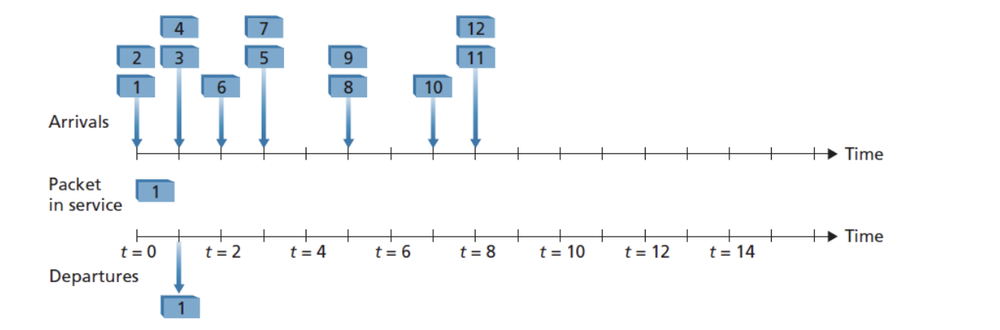

# Eksamen V2024

Subject: TTM4100 - KTN
Date: 28. mai 2025
Keywords: exam

## Q1 - Multiple Choice

**Q1.1.1 Circuit switching and packet switching have many differences. Which of the following is/are correct?**

a) While a circuit-switched network can guarantee a certain amount of end-to-end bandwidth for the
duration of a call, typically packet-switched networks cannot.
b) Most packet-switched networks today (including the Internet) can make end-to-end guarantees for bandwidth.
c) Typically, the delay variation among packets/messages in a circuit-switched network is smaller
than that in a packet-switched network.
d) The costs for dedicated resources in packet-switched network are usually higher than the costs for resources in circuit-switched network.
e) In circuit-switched networks, the bandwidth is shared among the users and allocated only when
data needs to be transmitted. It has a better bandwidth efficiency than in packet-switched
networks.

<aside>
📌

A circuit switched network establishes an end-to-end connection between sender and receiver. Therefore its easier for it to guarantee a certain amount of bandwidth. Since the connection is established, it does not need to check for a route at each node which is typical in a packet switched network. This makes the delay variation among packets smaller. The tradeoff is that in circuit switched networks the bandwidth may be wasted since its reserved for that connection only, meaning that when no data is transmitted, the connection is still reserved.

</aside>

---

**Q1.1.2 Suppose there is exactly one packet switch between a sending host and a receiving host. The transmission rates between the sending host and the switch and between the switch and the receiving host are R1 and R2, respectively. If the switch uses store-and-forward packet switching, what is the total end-to-end delay to send a packet of length L when queuing, propagation delay, and processing delay are ignored?**

a) L/(R1+R2)
b) L/R1+L/R2
c) 2L/Max {R1, R2}
d) 2L/Min {R1, R2}
e) None of the above

<aside>
📌

Since switch is using store-and-foward  packet siwtching, it means that the entire packet needs to be arrived before sending it further. All other delays are ignored which means that the time for the packet to arrive at the switch is L/R1, then to arrive to the host is L/R2.

</aside>

<aside>
📌

If it were to use a cut-trough switching instead of store-and-forward (it can send after receiving B bytes). The formula would be B/R1 + L/R1. This is the time to transmit the first B bytes (assuming B < Packet Size ) + the time needed to transfer the total packet. SEE: Pipelining effect

</aside>

---

**Q1.1.3 Consider a client and a server connected through one router. Assume the router can start transmitting an incoming packet after receiving its first 80 bytes instead of waiting for the whole packet. Suppose that the link rates are 1000 byte/s and that the client transmits one packet with a size of 3000 bytes to the server. What is correct for the end-to-end delay?**

a) 3,808s
b) 3,800s
c) 3,008s
d) 3,080s
e) None of the above

<aside>
📌

This is describing a cut-trough switch, with pipelining effect. The first 80 bytes takes a total of $\frac{80bytes}{1000 byte/s} = 0.08 s$ (this is the time it takes for the router to start transmitting to the server). The last byte then arrives at the router at $\frac{3000bytes}{1000bytes/s} = 3s$ and is instantly sendt to the server. So the total end to end delay is 3s +0.08s = 3.080. 

</aside>

---

**Q1.1.4 Protocol Layering is commonly used in computer networks because:**

a) It prevents network functionalities to be divided into separate layers, each with a specific purpose.
b) Encapsulation is the most efficient way to transmit data.
c) It provides a simple design for implementation and maintenance but more
complication in network developments.
d) It keeps networks structured and enables them to communicate faster.
e) Protocol layering can accommodate future enhancements and changes

<aside>
📌

New technologies can be implemented at each layer without having to redesign everything. - It enables seperation of functionalities (a).
- It is not always the most efficient, but it is structured (b).
- Layering simplifies development (c)
- It does keep networks more structured, but does not inherently make them faster.

</aside>

---

**Q.1.1.5 Consider sending P packets through a packet-switched network from source to destination. There are N store-and-forward routers between the source and the destination. Each packet has a length of L bits. Assume that all of the links in the network (e.g., the links between the source and the router, between the routers, and between the router and the destination) have the same transmission rate of R bps. What is the minimum end-to-end delay of sending P such packets back-to-back over the network? Ignore queuing, processing, and propagation delays.**

a) P**N**L/R
b) (N+P-1)**L/R
c) P**(N+1)*L/R
d) (N+P+2)*L/R
e) None of the above.

<aside>
📌

- All the links have the same transmission rate of L/R.
- All routers are using store-and-foward (entire packet must be received before transmitting).
- There are P packets.
- Since there are N routers, there are N+1 links.
- The packets are sendt back-to-back (pipelining) and each one takes L/R time to be transmitted. (because the first link is also L/R). That means that the gap between each packet also is L/R.

The first packet takes a total of (N+1)*L/R time to reach the destination. There is a delay of L/R between each packet sendt which means that the next packet after the first packet arrives L/R after. The total end-to-end delay is therefore (N+1)*L/R + (P-1) * L/R

Example:

Packet 1:  (n+1) * L/R

Packet 2: (n+1) * L/R + 1 * L/R (it arrives 1 L/R after)

Packet 3: (n+1) * L/R + 2 * L/R (it arrives 2 L/R after)

</aside>

---

**Q1.2.1 Which of the following protocols is/are not an Application-Layer protocol?**

a) Telnet (User Data Protocol)
b) TDM (Time Division Multiplexing)
c) SMTP (Simple Mail Transfer Protocol)
d) HTTP (Hypertext Transfer Protocol)
e) IMAP (Internet Message Access Protocol)

<aside>
📌

- Telnet - used for remote login over a network.
- TDM - is a multiplexing technique used at lower layers (link or physical) to combine multiple data streams
- SMTP - used for sending emails
- HTTP - used for transfering web pages
- IMAP - used for retreiving and managing emails on a mail server.

</aside>

---

**Q1.2.2 Web caching is normally set in between the clients (PCs in a university network) and an original server (e.g., a commercial website server). Which of the following statements is/are correct about Web caching?**

a) It does not reduce the average delay for all objects.
b) Averagely, it reduces the delay only for the objects that are cached.
c) Potentially, it can reduce the average delay for all the objects, even objects that are
not cached.
d) It increases the average traffic on the links (implies the links between a client and the
original server)
e) It has a storage on its own disk, and it prevents from keeping copies of recently
requested objects in this storage.

<aside>
📌

Web caching keeps copies of data closer to the user so that it doesnt need to be retreived from the main server every time it requests them. A result of this is reduction of traffic to the original server, which can reduce the delay of all objects, not just the ones cached.

</aside>

---

**Q1.2.3 Suppose a process in Host D has a UDP socket with a predefined port. Suppose Host A, Host B, and Host C each wants to send a UDP segment to Host C. What is minimal number of sockets required for sending those segments from Host A, B, and C to Host D?**

a) One socket
b) Two sockets
c) Three sockets
d) More than three sockets
e) None of the above

<aside>
📌

Could be two or one answer depending on the perspective (sender only / all hosts).

Sender:
Each host needs at least one socket to send, there are three senders → therefore there needs to be a minimum of three sockets. (c)

All hosts:
Same as sender, but needs to add the one for the host that receives (the receiver only needs one, even when retreiving segments from multiple senders). This means four sockets → more than three sockets (d)

</aside>

---

**Q1.2.4 Which of the following statement(s) is/are true?**

a) SMTP uses UDP as its underlying transport protocol.
b) Both UDP and TCP do not provide reliable data transfer service.
c) UDP is a connection-oriented protocol.
d) Internet Telephony application (e.g. SIP) can use UDP or TCP.
e) FDM (Frequency Division Multiplexing) requires more sophisticated analog hardware to shift
signal into appropriate frequency bands than what TDM (Time Division Multiplexing) does

<aside>
📌

- SMTP uses TCP (needs reliability)
- UDP is connectionless, it does not needs a setup.
- FDM involves modulating signals into different frequency bands (which is analog), TDM is digital.
</aside>

---

**Q1.2.5 Consider distributing a file of F=10 Gbits to N=100 peers using Client-Server architecture. The server has an upload rate of us=1Gbps. Each peer has a download rate of di=200Mbps. What is the minimum time to distribute this file to all the peers:**

a) 50s
b) 5000s
c) 500s
d) 1000s
e) None of the above

<aside>
📌

The minimum time to distribute the file is desided by the bottleneck (either upload or download speed) Since there are 100 peers, they need to share the upload rate of 1gbps → each peer can download at max 10Mbps, even though it supports 200Mbps The filesize is 10Gbits = 10000 Mbits. The time it takes is therefore 10000Mbits/10Mbps = 1000s.

This also means that the utilizaiton perecentage of the peers download speed is only 10/200 = 0.05 = 5%.

---

It can also be sovled using Max(time for server to upload file to all peers, time it takes for the slowest peer to download the file) →

Max((100*10Gbits)/1Gbps), 10000Mbits/200Mbits))

Max(1000, 50)

= 1000 seconds.

</aside>

---

**Q1.3.1** **Assign network addresses from 214.97.250/23 to a subnet that should have enough addresses tosupport 250 interfaces. The assignment takes the form a.b.c/x. Which of the following is/are possible correct subnet(s)?**

a) 214.97.245/24
b) 214.97.251/24
c) 214.97.253/24
d) 214.97.254/24
e) 214.97.254/25

<aside>
📌

The `/23` means that the first 23 bits of the 32-bit IP address are the network part, and the remaining 9 bits (i.e., `32 - 23 = 9`) are available for host addresses.

32-23 = 9 bits for hosts

Which means you can have 2^9 = 512 addreses (-2 for network + broadcast → 510 usable)

To support a 250 interface subnet we need at least 8 bits for hosts since 2^8 = 256 addresses (254 usable) This means we need a /24 subnet (32-8 = 24). (e) is not an option. since we would only get 128 addresses.

The range with the /23 subnet covers 512 addresses:

214.97.250.0 - 214.97.251.255.

The only one that fits is (b)

</aside>

---

**Q1.3.2 About DHCP (Dynamic Host Configuration Protocol), which of the following statement(s)
is/are false?**
a) When an internet host arrives, it implements 4-step process with a DHCP server for
acquiring a new IP address.
b) DHCP uses TCP (Transmission Control Protocol) as its transport protocol.
c) DHCP provides dynamic IP address assignment to network clients.
d) DHCP is primarily used for routing data packets between networks.
e) DHCP servers can offer additional configuration parameters such as DNS server
addresses and subnet masks.

<aside>
📌

The four step process is called DORA:

- Discovery
- Offer
- Request
- Acknowledgment

DHCP can assign subnet mask, ip-address, default gateway, DNS server. The main function is assigning ip addresses to network clients. DHCP uses UDP.

</aside>

---

**Q1.3.3 What is/are false about the Internet Control Message Protocol (ICMP)?**

a) ICMP is not primarily used in the network layer.
b) ICMP is a supporting protocol in the Internet protocol suite.
c) ICMP provides functions like error reporting and network diagnosis.
d) ICMP messages are used not only for signaling error conditions.
e) ICMP is a transport protocol used for data exchange between devices on the network.

<aside>
📌

ICMP is a network layer protocl used in the network layer and supports IP by reporting errors and providing diagnostics function (traceroute, ping).

</aside>

---

**Q1.3.4 In FIFO (First Input First Output) service below, the upper timeline shows arrival times of packets,and the lower timeline shows the start of timeslots where a packet is transmitted. Queuing delay for a packet is the period between its arrival time and the beginning of the slot in which the packet is transmitted. One example, packet 1 will be transmitted at the time of t=1, hence its delay is also 1.** 

**What is the average delay for the next three packets (packets 2, 3, and 4)?**

a) 8/3s
b) 7/3s
c) 2s
d) 5/3s
e) Nove of the above

<aside>
📌

Packet 2:

Arrives at t = 0

Departs at t = 2

Delay = 2-0 = 2

Packet 3:

Arrives at t = 1

Departs at t= 3

Delay = 3-1 = 2

Packet 4:

Arrives at t = 1

Departs at t = 4

Delay = 4-1 = 3

Total delay = 3+2+2 = 7

Average delay = 7/3

</aside>

---

**Q1.3.5 Consider the network below. Which of the following statements is/are true?**

a) It is possible to configure forwarding table in router A, such that all traffic destined to host
H3 is forwarded through interface 3.
b) It is not possible to configure forwarding table in router A, such that all traffic destined to
host H3 is forwarded through interface 3.
c) It is possible to configure a forwarding table in router A, such that all traffic from H1
destined to host H3 is forwarded through interface 3, while all traffic from H2 destined to
host H3 is forwarded through interface 4.
d) It is not possible to configure a forwarding table in router A, such that all traffic from H1
destined to host H3 is forwarded through interface 3, while all traffic from H2 destined to
host H3 is forwarded through interface 4
e) None of the above

<aside>
📌

In traditional IP routing, forwarding desicions are made using only the destination address only, and not the source. The forwarding table can only have one entry per destination address, meaning that the network would need to chose between interface 3 and 4.

(AI) *While policy-based routing or source-based routing could theoretically enable this, the question asks about configuring "a forwarding table" (singular), which typically refers to the standard destination-based forwarding table used in basic IP routing.*

</aside>

---

**Q1.4.1 What is/are false when comparing between switches and routers?**

a) Both routers and switches are the connecting devices in networking.
b) Routers operate at the Data link layer and switches operate at the Network layer.
c) Switches operate at the Data link layer and routers operate at the Network layer.
d) Switches connect various networks together while a router connects devices within a
network.
e) In operation, routers rely on IP addresses while switches rely on MAC addresses.

<aside>
📌

Routers operate at the network layer and connects various networks together, while the switch operates at the data link layer and connect devices withn a network.

</aside>

**Q1.4.2 Which of the following alternatives show(s) correct implementation(s) of a two- dimensional even parity scheme?**

<aside>
📌

A single row or column with odd amount of 1 (including the parity bit) = not a correct implementation.

Correct: d, h

</aside>

---

**Q1.4.3 About wireless physical-layer characteristics, which of the following statement(s) is/are
correct regarding the relations between SNR (Signal-to-noise ratio), BER (Bit Error Rate), and
Modulation schemes?**

a) For a given a modulation scheme, the lower the SNR, the higher the BER.
b) For a given modulation scheme, the lower the SNR, the lower the BER.
c) For a given SNR, a modulation technique with a higher bit transmission rate has a
lower BER.
d) For a given SNR, a modulation technique with a higher bit transmission rate has a
higher BER.
e) None of the above is correct.

<aside>
📌

SNR measures how strong the signal is compared to background noice. Lower SNR means that there is more noise relative to the signal → harder to decode bits correctly → higher BER.

High-rate modulation schemes pack more bits into each symbol, but are more error-prone for the same SNR, since they are closer together in signal space.

</aside>

---

**Q1.4.4 What is/are correct about CSMA/CA (Carrier Sense Multiple Access with Collision
Avoidance) protocol and RTS (Request to Send)/CTS (Clear to Send) message exchange?**

a) Hidden node issue still physically happens with systems use CSMA/CA
b) In CSMA/CA, when a node wants to transmit, it sends a RTS to the AP (Access
Point). The AP responds with a CTS, granting permission for the node to transmit
c) During the RTS/CTS exchange, hidden nodes can not overhear these frames.
d) The RTS/CTS mechanism completely solves the exposed node problem.
e) The RTS/CTS mechanism is used in CSMA/CA to improve channel access.

<aside>
📌

RTS/CTS mechanism is used in CSMA/CA to help avoid collitions. 

Problem: 3 nodes: A, B, C. B can hear both but A and C cannot hear eachother. If A and C sends at the same time to B → collition.

Main idea:

- A sends a RTS to B.
- B responds with a CTS if channel is clear, C also hears the CTS, so it knows someone else is transmitting, and it waits.
- A sends data safely.

While it is a solution, it does not completely remove the problem, as collitions can still happen.

CSMA/CA is used in WiFi

</aside>

---

**Q.1.4.5 This question considers two access protocols: ALOHA (pure ALOHA) and slotted
ALOHA. What of the following statements is/are true?**

a) Pure ALOHA has lower efficiency compared to slotted ALOHA.
b) Maximum efficiency achievable in slotted ALOHA is two times higher than that in
pure ALOHA.
c) Slotted ALOHA reduces the number of collisions compared to pure ALOHA.
d) In Slotted ALOHA, any station can transmit data at any time without synchronization.
e) In pure ALOHA, stations must wait for the beginning of the next time slot to transmit
data.

<aside>
📌

ALOHA is a random access protocol that operates at the data link layer. It is used for sharing a communcation medium along multiple users. The key idea is to send data whenever they have it, and if collition happens, they wait a random time and try again.

In pure ALOHA, devices transmits data whenever they have data. (18.4% max efficiency)

In slotted ALOHA, devices must wait for the start of a slot to send data, which reduces the chance of collition. (36.8% max efficiency)

</aside>

---

**Q1.5.1 Which of the following are desirable properties of secure communication:**
a) Network reliability.
b) Confidentiality
c) Message integrity.
d) Operational security
e) High bandwidth to transmit the message quickly

---

**Q1.5.2 Suppose N people want to communicate with each other using symmetric key encryption. All communication between any two people is visible to all other people in this group and no other person in this group should be able to decode their communication. How many keys are required in the system as a whole?**
a) N**N
b) 2**N-1
c) N*(N-1)
d) N*(N-1)/2
e) None of the above

<aside>
📌

In a symmetric key encryption, each pair of people only needs 1 key. N people each need a key with (N-1) people. So N*(N-1), but since they only need 1 key, you divide by 2. 

If it were using anti symmetric key encryption, each person needs a public and a private key. So the answer would be 2N.

</aside>

---

**Q1.5.3 For message integrity, which of the following statement(s) is/are correct?**
a) Message integrity is the property that the identity of the sender can be confirmed to be
who or what they claim to be.
b) Message integrity is the property that the receiver can detect whether the message
sent was altered in transit.
c) Both checksumming and hashing techniques may be used.
d) Generally, a hash provides a better message integrity check than a checksum.
e) To ensure message integrity, the transport layer protocol used to communication the
message has to be TCP.

---

**Q1.5.4 In video streaming applications, HTTP streaming (over TCP) is more popular than UDP
streaming. The major reasons include:**

a) UDP is connectionless.
b) UDP lacks retransmission, ordering, and error-checking mechanism result in higher
error rate.
c) UDP streaming lacks handshakes and acknowledgement results in lower latency.
d) Many firewalls are often configured to block most UDP traffic but to allow most HTTP traffic.
e) None of the above

---

**Q1.5.5 Considering information transmission between Alice and Bob through a network with the existence of an intruder (Trudy). Choose which of these statements is/are correct regarding what kinds of information the intruder can access and what kinds of action can be taken:**

a) Sniffing and recording control messages on the channel
b) Recording data messages on the channel
c) Modifying or insertion of messages
d) Deletion of message or message content
e) None of the above

---

## Ordinary questiosn

**Q2. There are two hosts, Host A and B are directly connected with a 10 Gbps link. There is one TCP connection between the two hosts, and Host A is sending to Host B an enormous file over this connection. Host A can send its application data into its TCP socket at a rate as high as 1 Gbps, but Host B can read out of its TCP receive buffer at a maximum rate of 600 Mbps.**

**Describe the effect of TCP flow control in this TCP connection.**

<aside>
📌

TCP flow control uses the receivers window to prevent overwhelming the receiver. The buffer of host B will start to fill up and the receiver will advertise a smaller window (RCWND) to host A in TCP Acks. Host A starts slowing down to match the window size, it cannot send more than the advertised window. This prevent buffering and packet loss at host B.

As a result, the effectiv transfer rate will be limited by host B reading speed (600Mbps), even though host A can send 1000MBps

</aside>

**Q3. Consider the Wireshark output below for a portion of an SSL (Secured Socket Layer) session.
Answer these questions [5 points]**

**Q3.1 Was Wireshark packet 112 sent by the client or server?**

<aside>
📌

In packet 106 the Client hello, which is sent by the client, is sent by 128.238.38.162. We can see that packet 112 has the source 128.238.38.162 and is therefore sent by the client.

</aside>

**Q3.2 What is the server’s IP address and port number?**

<aside>
📌

In the “Transmission Control Protocol” in light grey, we can se destination port and the destination is highlighted in the 112 frame. (it is also over the destination port)

- Server IP: 216.75.194.220
- Destination Port: 433
</aside>

**Q3.3 Assuming no loss and no retransmissions, what will be the sequence number of the next TCP segment sent by the client? Explain how you got this number.**

<aside>
📌

The current TCP segment has a Sequence number of 79 and a len of 204 (shown in “transmission control protocol” in light grey)

The next sequence number is calculated by taking the current sequence number + length of the segment.

So the answer is 79+204 = **283.**

</aside>

**Q3.4 How many SSL records does Wireshark packet 112 contain?**

<aside>
📌

3.

- Client key exchange
- Change cipher spec
- Encrypted handshake message.
</aside>

**Q3.5 Does packet 112 contain a Master Secret or an Encrypted Master Secret or neither?**

<aside>
📌

The steps are:

1. Client sends client random (random string of bytes) , along with a set of cipher suites (encryption methods) 
2. Server sends server random, along with SSL certificate and decided cipher suite
3. Client generates a pre master secret and encrypts it with server public key (retreived by authenticating SSL certificate) and it gets sent in the client key exchange message. (the step we are on)
4. Then both client and server computes the master secret that uses the pre master secret, server random and client random.

Answer is therefore neither, since its the encrypted pre-master secret that is being sent.

</aside>

---

**Q4. An IP address consists of a subnet part and a host part. To determine which the subnet an IP address belongs to, you must know the subnet mask. Answer these questions:**

**Q.4.1. How to find out the subnet based on the IP address and the subnet mask?**

<aside>
📌

Convert both IP address and subnet mask into binary, then do an “AND” operation. 

</aside>

**Q.4.2 Given an IP address of 192.168.1.108 and the subnet mask /30 (255.255.255.252), what is the subnet address? Justify your answer.**

<aside>
📌

Convert both into binary and perform an AND operation. (Only 1 & 1 is 1)

Convert back: 128.168.1.108/30

</aside>

**Q.4.3 Given an IP address of 192.168.2.108 and the subnet mask /29 (255.255.255.248), what is the
subnet address? Justify your answer.**

<aside>
📌

192.168.2.104/29

</aside>

**Q.4.4 Given an IP address of 192.168.3.108 and the subnet mask /28 (255.255.255.240), what is the
subnet address? Justify your answer.**

<aside>
📌

192.168.3.96/28

</aside>

---

**Q.5 In the Figure below, there are four wireless nodes, A, B, C, and D. The radio coverages of these nodes are shown as the shaded ovals; all nodes share the same frequency. When A transmits, it can only be heard/received by B; when B transmits, both A and C can hear/ receive from B; when C transmits, both B and D can hear/receive from C; when D transmits, only C can hear/receive from D. Suppose now that each node has an infinite supply of messages that it wants to send to each of the other nodes. If a message’s destination is not an immediate neighbor, then the message must be relayed via intermediate node(s). Time is slotted and it take exactly one time slot for one message transmission. During a slot, a node can do one of the following: (i) send a message, (ii) receive a message, (iii) remain silent. As always, if a node hears two or more simultaneous transmissions, a collision occurs and none of the transmitted messages are received successfully. Assume that when one message is sent, it will be received correctly by other nodes within the transmission radius of the sender if no collision occurred at those nodes. Assume a message has a length of L (bits) and a time slot of T (second). Provide answers to these questions:**

**Q.5.1 Suppose now that A sends messages to B, and D sends messages to C.
What is the combined maximum rate at which data messages can flow from A to B and from D to C? Justify your answer.**

<aside>
📌

A → B and D → C can happen at the same time since there is no collition. It only needs one time slot.

2L/T

</aside>

**Q.5.2 Suppose now that A sends messages to B, and C sends messages to D.
What is the combined maximum rate at which data messages can flow from A to B and from C to D? Justify your answer.**

<aside>
📌

A can send to B with no problem, but since A is sending to B, C cannot send to D at the same time (since B will also hear it)

Slot1:

- A → B

Slot2:

- C→D

So the answer is 2 messages every 2 slot: 2L/2T = L/T

</aside>

**Q.5.3. In this scenario, suppose that for every data message sent from source to destination, the destination will send an ACK message back to the source (e.g., as in TCP). Also suppose that each ACK message takes up one time slot.**
**Q.5.3.1 Repeat the question Q.5.1 for this scenario.**

<aside>
📌

A →B and D→C happens at the same time but the ACK has to be divided since B and C can hear each other.

Slot1:

- A →B
- D→C

Slot2: 

- B→A (ACK)

Slot3:

- C→D (ACK)

So its 2 messages every 3 time slots = 2L/3T

</aside>

**Q.5.3.2 Repeat the question Q.5.2. for this scenario.**

<aside>
📌

A→B and C→D happens over 2 slots, but the ACK can happen simulationusly to the sending of A → B. If C sends to D first.

Slot1:

- C→D

Slot2:

- A → B
- D → C (ack)

Slot3:

- B → A (ACK)

So its 2 messages every 3 slot = 2L/3T

</aside>

---

**Q.6.1 Describe the format of a Resource Record (RR) in DNS.**

<aside>
📌

- Type
- Name
- Value
- TTL

| Type | Name | Value |
| --- | --- | --- |
| A | A hostname | Ip of hostname |
| NS | A Domain Name | The hostname of an authoritative DNS server that
knows how to obtain the IP addresses for hosts in the
domain |
| CNAME | Name | A canonical hostname for the alias hostname Name |
| MX | Name | The canonical name of a mail server that has an alias
hostname Name |

</aside>

**Q.6.2 What kind of information can be communicated to a client when it sends a DNS query?**

<aside>
📌

Information includes:

- Hostname to IP address mapping
- hostname alias to ip address mapping
- mailserver information of a spesific domain
- authorative name server information
</aside>